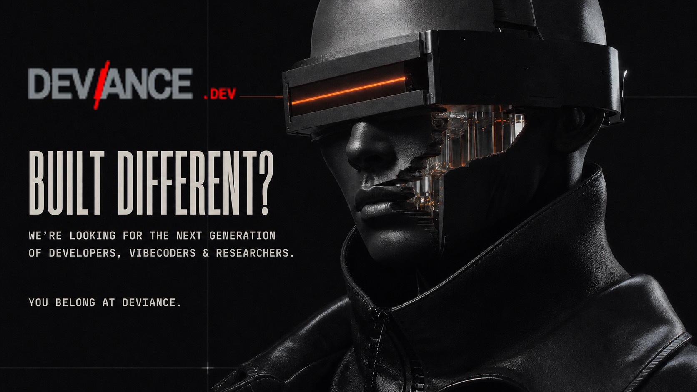
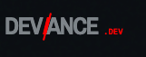

  

  

# DEViance Intelligence

## Built different? Good.

We are looking for the next generation of **developers, vibecoders, and
researchers** — people who see what could exist and cannot wait for permission
to build it.

If the normal path never fit you, DEViance is where you need to be.

> **We do not care what your title is. We care what you can make real.**

### Who belongs here

| Your signal | What it looks like |
|---|---|
| **Developer** | You see the system and make it survive contact with reality. |
| **Vibecoder** | You turn intent into momentum before the category has a name. |
| **Researcher** | You ask the question that changes the map. |

### What we make

- AI-native products that do more than decorate an old workflow
- agentic systems that can be inspected, tested, and trusted
- research prototypes that force a new question
- tools for builders moving faster than the category around them

### The only application that matters

Show us the strange thing you built because it needed to exist.

No pedigree theater. No innovation vocabulary. Send the repository, the
prototype, the experiment, or the question you cannot leave alone.

**[Enter the work](https://github.com/maxkle1nz/deviance.dev)** ·
**[Meet the founder](https://github.com/maxkle1nz)**

<strong>IF YOU ARE BUILT DIFFERENT, YOU BELONG AT DEVIANCE.</strong>

